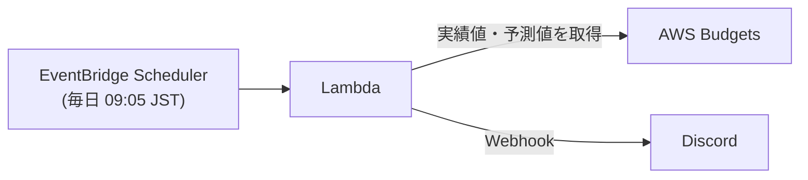

# aws-cost-keeper
AWSの使用料金を日次でDiscordに送信


## 構成


| リソース | 内容 |
| --- | --- |
| AWS Budgets | 月次のコスト予算 (過去6か月の実績から自動調整) |
| Lambda | Budgetsから当月の実績値・月末予測値を取得し、DiscordのWebhookへ送信 |
| CloudWatch Logs | Lambdaのロググループ (保持期間: 30日) |
| EventBridge Scheduler | Lambdaを定期実行 (既定: `cron(5 0 * * ? *)` = JST 09:05) |
| IAM | Lambda実行ロール、Scheduler用ロール |

## 依存関係
* HCP Terraform からAWSへの動的認証情報 (Dynamic Provider Credentials) を事前設定  
  https://developer.hashicorp.com/terraform/cloud-docs/workspaces/dynamic-provider-credentials/aws-configuration

## フォルダ・ファイル構成
```
.
├── .github/
│   ├── dependabot.yml             # Dependabot設定 (devcontainers / GitHub Actions / Terraform)
│   └── workflows/
│       ├── claude.yml             # Claude Code連携ワークフロー
│       └── documentation.yml      # terraform-docsによるドキュメント生成 (PR時)
├── app/                           # Lambdaアプリ本体
│   ├── src/                       # Lambdaにデプロイするソースコード (zipのルートになる)
│   │   ├── main.py                # ハンドラー (main.lambda_handler)
│   │   ├── budgets.py             # AWS Budgetsから実績値・予測値を取得
│   │   └── discord.py             # DiscordのWebhookへ送信
│   ├── tests/                     # テストコード
│   ├── pyproject.toml
│   ├── requirements.txt           # 開発・テスト用の依存パッケージ
│   └── requirements-lambda.txt    # Lambdaのzipに同梱する依存パッケージ
├── docs/                          # README用画像
├── template.yaml                  # 移行元のSAMテンプレート (参考用)
└── terraform/
    ├── shared/                    # 全環境共通のTerraformコード
    │   ├── main.tf                # Budgets / Lambda / Scheduler / IAM 等のリソース定義
    │   ├── providers.tf
    │   └── variables.tf
    └── env/
        └── prd/                   # 本番環境 (terraformコマンドはここで実行)
            ├── main.tf            # -> ../../shared/main.tf (シンボリックリンク)
            ├── providers.tf       # -> ../../shared/providers.tf (シンボリックリンク)
            ├── variables.tf       # -> ../../shared/variables.tf (シンボリックリンク)
            ├── terraform.tfvars   # 環境固有の変数値
            └── versions.tf        # Terraform / Provider バージョン、HCP Terraform設定
```

環境を追加する場合は `terraform/env/<環境名>/` を作成し、`shared/` 配下の `.tf` へのシンボリックリンクと、環境固有の `terraform.tfvars` / `versions.tf` を配置します。

## 変数
| 変数名 | 必須 | 既定値 | 説明 |
| --- | --- | --- | --- |
| `env_name` | ○ | - | 環境名 (`terraform.tfvars` で指定) |
| `discord_webhook_url` | ○ | - | 通知先DiscordのWebhook URL (sensitive) |
| `system_name` | | `costkeeper` | システム名 (リソース名のプレフィックス `<system_name>-<env_name>` に使用) |
| `aws_region_name` | | `ap-northeast-1` | AWSリージョン |
| `schedule_expression` | | `cron(5 0 * * ? *)` | Lambdaの実行スケジュール (UTC) |
| `log_retention_in_days` | | `30` | Lambdaのログ保持期間 (日) |
| `tfc_aws_dynamic_credentials` | | `null` | HCP Terraformの動的認証情報 (HCP Terraformが自動で設定) |

`discord_webhook_url` はHCP Terraformのワークスペース変数に **Sensitive** として登録してください。  
なお、この値はLambdaの環境変数として設定されるため、Terraformのstateにも保存されます。

## デプロイ
以前はGitHub Actions (SAM) でデプロイしていましたが、Terraformからのデプロイに変更しました。

```sh
cd terraform/env/prd
terraform init
terraform plan
terraform apply
```

### Lambdaのzip作成の流れ
`terraform apply` 時に、`terraform_data.lambda_package` が以下を実行します。

1. `requirements-lambda.txt` の依存パッケージを、Lambdaのランタイム・アーキテクチャ向けに `pip install`
2. `app/src/` 配下のソースコードをコピー (`__pycache__` は除外)
3. `terraform/env/prd/.build/lambda.zip` として圧縮 (`.build/` はGit管理外)

Lambdaの更新判定には、zipファイルではなく「ソースコード・依存パッケージ・ランタイム」から算出したハッシュを使用しています。  
そのため、plan/applyが別環境で実行される場合 (HCP Terraform等) でも、ソースコードに変更がなければ差分は発生しません。  
ソースコードや `requirements-lambda.txt` を変更した場合のみ、zipの再作成とLambdaの更新が行われます。

ランタイム・アーキテクチャは `terraform/shared/main.tf` の `locals` (`lambda_runtime` / `lambda_architecture` / `lambda_pip_platform`) で変更できます。
